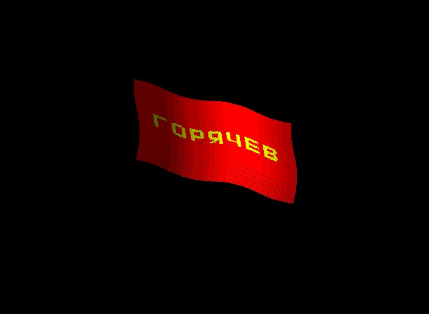

# Базовая графическая библиотека (BGL)

Графическая библиотека содержит алгоритмы компьютерной графики:
- пиксел;
- линия ЦДА;
- линия Брезенхема;
- круг Брезенхема;
- заливка;
...

С помощью BGL отображены:
- фрактал Коха;
- колышущийся флаг;
...

Может работать с разными драйверами дисплея.
Версия драйвера для Windows 10.

Написана на языке C

Статус проекта: Разрабатывается.

Copyright (c) 2022 Evgeny Goryachev  
Gor.Com 